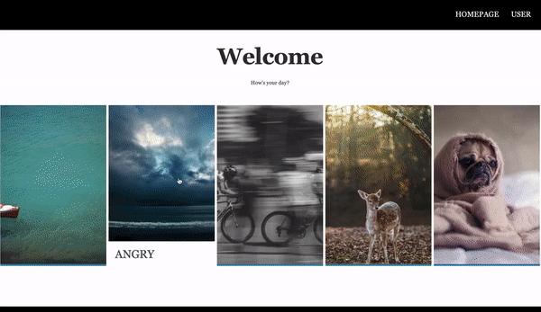

# Movie_Booking_System

### Prerequisites

Postgres SQL

```
# postgres as database
apt-get install postgresql postgresql-contrib
```

Flask & Psycopg2
```
# flask as connection to postgres
pip3 install flask flask_sqlalchemy flask_migrate flask_bootstrap flask_wtf

# psycopg as python3 to postgres API
pip3 install psycopg2
```

Beautifulsoup
```
# beautifulsoup4 for getting data
pip3 install beautifulsoup4
```
### execute
```
Macos:
Download postgresql,and create folder name "DBMS_movie"
use createtable.sql and import csv file.
The .csv file can be climbed by the file in folder 'climb'.
And run python3 main.py "your postgresql password"
```

### DEMO


